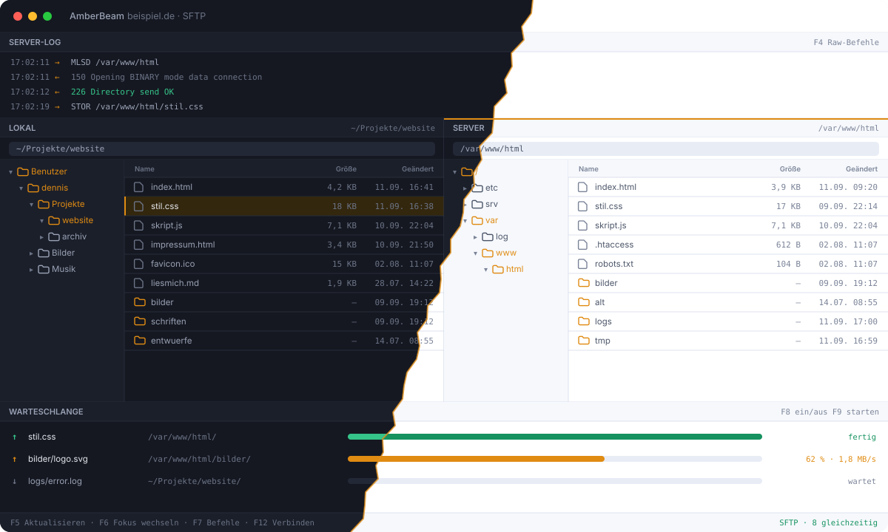

<div align="center">


# AmberBeam — dual-pane FTP and SFTP client for macOS, Windows and Linux

**A keyboard-driven, two-pane file transfer client.** Server log on top, two
file panes with folder trees in the middle, transfer queue at the bottom.
Native app on macOS, Windows and Linux, and a container with a web interface
for your own server.

[](LICENSE)
[%20%7C%20Windows%20%7C%20Linux%20%7C%20Docker-2b3040?style=flat-square)](#build-it-yourself)
[](https://www.rust-lang.org/)
[](https://svelte.dev/)
[](https://github.com/sphings79/amberbeam/actions/workflows/ci.yml)
[](https://github.com/sphings79/amberbeam/stargazers)

[Deutsche Version](README.de.md) · [Status](#status) · [What it will be](#what-it-will-be) · [The three seams](#the-three-seams) · [Build it yourself](#build-it-yourself) · [Roadmap](#roadmap) · [Translating](#translating) · [Licence](#licence)

**By the same hand:** [AmberChest — IMAP mail backup in plain .eml files](https://github.com/sphings79/amberchest)

</div>

---

## Status

> **Milestone M2: it connects over SFTP, and it transfers.**
> Two panes with folder trees, a queue that survives a restart, transfers that
> pick up where they broke off, and the questions that have to be asked before
> a file is overwritten. FTP and FTPS arrive with M3, the site manager with M4.
> The [roadmap](#roadmap) says what is done and what is not, and this README
> will not claim otherwise.
>
> It is not finished software. There is no site manager yet, the function key
> setup is still to come, and nothing has been signed or notarised.

## Why another file transfer client?

Transmit and ForkLift are good programs. They are also, through and through,
Mac programs. What people moving from Windows miss is not a feature list — it is
a set of **movements**: the function keys, switching panes with a keystroke, the
folder tree beside each list, the queue at the bottom, the raw server log at the
top. Anyone who spent years in a two-pane client on Windows knows those in their
hands, and on the Mac that muscle memory has nowhere to go.

AmberBeam is built for exactly that gap. Where platform convention and that old
habit collide, **habit wins** — as long as the program does not end up fighting
the operating system. Where it would, you are asked on first run which way you
want it.

The same reasoning carries it to Linux, where nothing of the kind exists either,
and back to Windows, where the two-pane clients people learned on have been
standing still for years.

## Screenshots

<div align="center">



<em><strong>The window</strong>, dark and light torn apart down the middle.
Drawn rather than photographed: a drawing stays sharp at any size, weighs a few
kilobytes, and a change to it shows up in a diff. Nothing on it is invented —
this is what the program does.</em>

</div>

## What it will be

Version 1, as specified:

- **SFTP, FTP and FTPS**, explicit `AUTH TLS` by default, implicit on port 990
  supported, plain FTP possible but visibly marked
- **Two panes, each with a folder tree and a file list.** Either side can be
  local *or* a server — two servers side by side are explicitly allowed
- **Transfer queue** that survives a restart, moving **several files at the same
  time** — how many is set per server (SFTP 8, FTP 4 by default, up to 64),
  because a shared hoster that allows four logins will refuse the fifth
- **No FXP.** A transfer between two servers runs through AmberBeam, not
  directly between the two. The architecture leaves that door open; version 1
  does not walk through it
- **Resuming a single file that broke in mid-transfer** — not just the queue.
  Size and timestamp of the source are compared first, and if they changed you
  are asked instead of silently handed a file stitched from two versions
- **Site manager with import** from FileZilla, WinSCP, `~/.ssh/config` and
  Total Commander, plus the site files of the older Windows clients — because
  nobody retypes thirty servers
- **PuTTY `.ppk` keys** read and converted, the one thing no Mac client does and
  every Windows switcher needs
- **The function key layout from the Windows two-pane clients** — F5 refresh,
  F6 switch focus, F8 queue, F9 start — freely remappable. On macOS, where F1 to
  F12 belong to the system by default, a first-run dialog offers three ways
  out
- **Credentials in the system's own store** — Keychain on macOS, Credential
  Manager on Windows, Secret Service on Linux. Never in a configuration file
- **German and English**, light, dark and system theme, five accent colours
- **No cloud, no accounts, no telemetry**

Later: directory synchronisation, comparing both sides, remote editing,
scheduled jobs, the container build, S3 and WebDAV — and FXP if it ever earns
its place.

## The three seams

Three decisions had to be right before the first line of code, because adding
them afterwards means touching every call site:

| # | Seam | What it means |
|---|------|---------------|
| 08 | **Source and target are endpoints** | The transfer engine knows two arbitrary endpoints and never assumes one side is local. Server-to-server copying and, later, FXP are additional cases — not a rebuild of the foundation |
| 09 | **One door to the core** | The interface never calls Tauri. Everything goes through `src/lib/bridge`, which has two implementations: Tauri's channel, and HTTP plus WebSocket for the container build |
| 11 | **No text in the code** | Every string goes through `t()` and lives in a flat JSON language file. English is the fallback, so a half finished translation can never show a raw key |

Seams 2 and 3 are checked on every build by `scripts/check-seams.mjs` and
`scripts/check-lang.mjs`, because a rule nobody enforces holds only as long as
everybody remembers it.

## Build it yourself

You need [Rust](https://rustup.rs) and Node 22 or newer on every platform, plus
what your system needs to build a native window:

| | Additionally |
|---|---|
| **macOS 13+, Apple Silicon** | `xcode-select --install` |
| **Windows** | Microsoft C++ Build Tools and the WebView2 runtime (Windows 11 ships it) |
| **Linux** | `sudo apt install libwebkit2gtk-4.1-dev libappindicator3-dev librsvg2-dev patchelf libgtk-3-dev` |

Then, everywhere the same:

```sh
git clone https://github.com/sphings79/amberbeam.git
cd amberbeam
npm install
npm run tauri dev     # development window with hot reload
npm run tauri build   # app and installer in target/release/bundle
```

What comes out: `.app` and `.dmg` on macOS, `.msi` and an NSIS installer on
Windows, `.deb`, `.rpm` and an AppImage on Linux.

> **On the Mac that means Apple Silicon, and only Apple Silicon.** No Intel
> build and no universal binary: macOS 26 Tahoe is the last release to carry
> Intel at all, and anyone buying a Mac today to leave Windows behind buys a
> MacBook Air or a Mac mini — both Apple Silicon for generations. Rust and Tauri
> are architecture-agnostic, so an Intel build is one line in the build
> settings. The door stays open; we just do not walk through it.

The first `cargo build` downloads a lot and takes several minutes. That is
normal, not a hung process.

> **Honestly:** only the macOS build runs on the author's own machine. Windows
> and Linux are built by CI on every push, which proves they compile and
> package — not that they feel right. Bug reports from those two are welcome and
> will be taken seriously.

The macOS `.dmg` is **ad-hoc signed, not notarised**, and the Windows installer
is unsigned — there is no paid Apple membership and no code signing certificate
behind this yet. On your own machine that is enough; elsewhere Gatekeeper and
SmartScreen will have their say.

### Checks

```sh
npm run verify                    # language files, seams, types
cargo test --package amberbeam-core
cargo clippy --package amberbeam-core --all-targets -- -D warnings

# Against a real SFTP server, one login at a time
dev/test-sftp-server.sh start
AMBERBEAM_TEST_SFTP=127.0.0.1:2222 \
  cargo test --package amberbeam-core --test sftp -- --test-threads=1
dev/test-sftp-server.sh stop
```

The core is a separate crate that knows nothing about Tauri, so it builds and
tests on any system — deliberately, because the container build of M7 depends on
that staying true. CI enforces it on every push.

### Regenerating the pictures

```sh
python3 dev/make-screenshots.py
dev/render-png.py assets/social-preview.svg assets/social-preview.png 1280 640
dev/render-png.py assets/icon.svg assets/icon.png 1024 1024
npm run tauri icon assets/icon.png
```

`make-screenshots.py` draws the window once per language — every label, file
name, date and size comes from one table at the top of the script, so an
English page never shows a German window.

`render-png.py` uses QuickLook and `sips`, so it needs a Mac. The SVGs
themselves are the source of truth and are readable anywhere.

## Roadmap

| | Milestone | State |
|---|---|---|
| **M0** | Scaffold: a window, installers on three platforms, the three seams, licence and README | **done** |
| **M1** | SFTP: connect with password, key or agent, list directories, tree and list, two panes, focus switching, file operations | **done** |
| **M2** | Transfers: queue, concurrency, resuming, conflicts, progress, drag and drop | **done** |
| **M3** | FTP and FTPS: control and data channel, `MLSD` preferred, `LIST` with dialect detection as fallback | next |
| **M4** | Site manager: system credential store, import from FileZilla, WinSCP, OpenSSH and the older Windows clients, export | |
| **M5** | Keyboard and settings: function keys, first-run dialog, remappable schemes, raw commands, server search | |
| **M6** | Polish: icon, signing and notarisation, help, first release | |
| **M7** | Container: the same core behind an HTTP and WebSocket service, single user, Docker image for amd64 and arm64 — transfers between two remote servers then run there instead of through your home line | |

## Translating

Languages are flat JSON files under `src/lib/i18n/`. Copy `en.json`, translate
the values, keep the keys, and send a pull request — or, once M5 lands, drop the
file into the application's language folder and restart. No build step, no
toolchain.

`npm run check:lang` tells you what is missing or surplus.

## Licence

**AGPL-3.0-or-later.** The Affero clause is here for one reason: the container
build. Anyone who takes it, changes it and offers it as a paid service over a
network has to publish their changes. For the app on your desk the difference is
nil — a desktop program offers nobody network interaction.

---

<div align="center">

**If you want to see this finished, a star helps.** It is how the next person
looking for a proper two-pane client finds it.

[](https://buymeacoffee.com/sphings)

</div>
